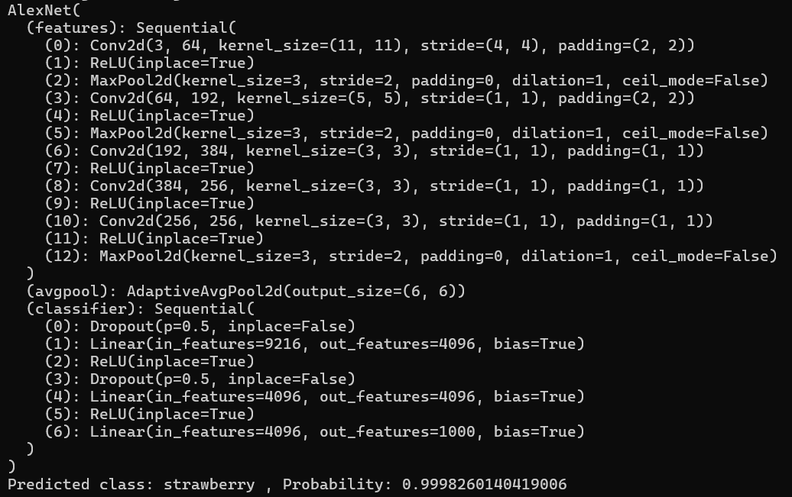

### 题目：

源代码（可选）：

### 一、问题描述

#### 1.1 待解决问题的解释

#### 1.2 问题的形式化描述（可选）

---

### 二、系统

#### 2.1 系统架构

#### 2.2 各部分介绍

#### 2.3 算法的伪代码

---

### 三、实验

#### 3.1 实验环境

#### 3.2 数据

#### 3.3 实验结果

（中间结果 + 最终输出结果截图）

---

### 四、总结与展望

---

### 五、参考文献