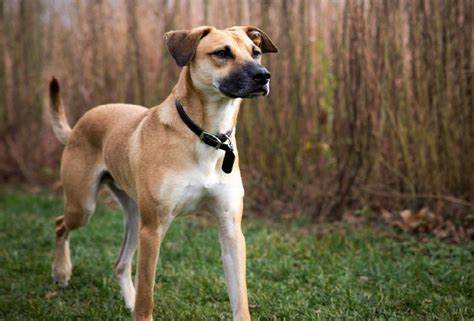
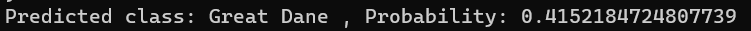
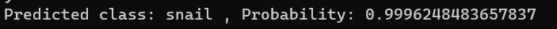
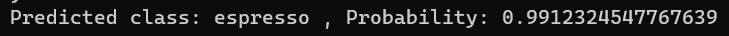
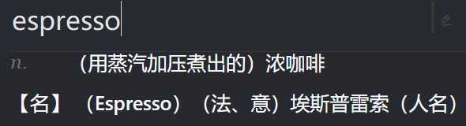

姓名：巩羽飞丨学号：2021522077丨班级：2021669101丨课程：智能信息网络实验

### 题目：Lab1 AlexNet图像分类

源代码见文末

### 一、问题描述

#### 1.1 待解决问题的解释

本实验旨在利用预训练好的图像分类模型 AlexNet，通过载入示例图像并对其进行预处理，利用预训练好的模型进行图像分类，并输出分类结果及其对应的概率。

#### 1.2 问题的形式化描述

给定一个示例图像集合 $\mathcal{I}$，其中每个示例图像 $i$ 表示为 $\mathbf{I}_i$，目标是利用预训练好的图像分类模型 $f(\cdot)$，对每个示例图像进行分类，得到其所属类别 $\mathcal{C}$ 和对应的分类概率 $\mathcal{P}$，即：$\mathcal{C},\mathcal{P}=f(\mathbf{I_i})$

### 二、系统

#### 2.1 系统架构

本系统包括以下三个组成部分：

- 图像分类模型：利用 torchvision 中提供的预训练好的图像分类模型，本实验中使用 AlexNet。
- 数据预处理模块：对输入的示例图像进行预处理，以符合模型输入要求。
- 图像分类模块：利用预训练好的模型对预处理后的图像进行分类，并输出分类结果及其对应的概率。

#### 2.2 各部分介绍

- 图像分类模型：使用 torchvision 中的 `models` 模块提供的预训练好的图像分类模型。这些模型经过在大规模图像数据集上的训练，能够准确地识别图像中的对象。
- 数据预处理模块：利用 `transforms` 模块提供的预定义转换函数对输入的示例图像进行预处理，包括尺寸调整、中心裁剪、转换为张量以及归一化等操作，以便与模型输入匹配。
- 图像分类模块：利用预训练好的图像分类模型对预处理后的图像进行分类，并输出分类结果及其对应的概率。

#### 2.3 算法的伪代码

```
// 顺序结构
1. 加载示例图像
2. 加载预训练的图像分类模型
3. 打印网络结构
4. 定义数据预处理操作
5. 对示例图像进行预处理
6. 将模型移到GPU上
7. 执行预测
8. 获取预测结果
9. 输出分类结果及其对应的概率
```

### 三、实验

#### 3.1 实验环境

- PyTorch：用于构建和训练深度学习模型。
- torchvision：提供预训练的图像分类模型和数据转换操作。
- PIL：Python Imaging Library，用于图像处理。
- GPU：用于加速深度学习模型的训练和推断。

#### 3.2 数据

本实验使用的示例图像位于本地路径：`./images/demo1.jpg`

#### 3.3 实验结果














可以看到，大部分的结果还是很不错的。

### 四、总结与展望

本实验展示了如何利用预训练好的图像分类模型对示例图像进行分类。通过对示例图像进行预处理，并利用预训练好的模型进行推断，可以得到图像的分类结果及其对应的概率。在未来，可以进一步扩展实验，尝试不同的预训练模型以及调整预处理操作，以提高图像分类的准确性和泛化能力。

### 五、参考文献

[1] PyTorch Documentation: https://pytorch.org/docs/stable/index.html

[2] torchvision Documentation: https://pytorch.org/vision/stable/index.html

[3] Python Imaging Library Documentation: https://pillow.readthedocs.io/en/stable/

### 六、附录

```Python
"""
Lab1 AlexNet图像分类源代码：
"""
import torch
from torchvision import models, transforms
from PIL import Image

# 本地图像文件路径
img_path = "./images/demo1.jpg"

# 加载示例图像
img = Image.open(img_path)

# 加载预训练的AlexNet模型
model = models.alexnet(pretrained=True)
model.eval()

# 打印网络结构
print(model)

# 定义数据转换
preprocess = transforms.Compose([
    transforms.Resize(256),
    transforms.CenterCrop(224),
    transforms.ToTensor(),
    transforms.Normalize(mean=[0.485, 0.456, 0.406], std=[0.229, 0.224, 0.225]),
])

# 对图像进行预处理
input_tensor = preprocess(img)
input_batch = input_tensor.unsqueeze(0)

# 将模型移到GPU上
device = torch.device("cuda" if torch.cuda.is_available() else "cpu")
model.to(device)
input_batch = input_batch.to(device)

# 执行预测
with torch.no_grad():
    output = model(input_batch)

# 获取预测结果
probabilities = torch.nn.functional.softmax(output[0], dim=0)
class_idx = torch.argmax(probabilities).item()

# 加载类别标签
with open("./imagenet_classes.txt") as f:
    classes = [line.strip() for line in f.readlines()]

# 打印分类结果
print("Predicted class:", classes[class_idx], ", Probability:", probabilities[class_idx].item())

```

