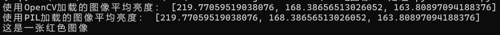
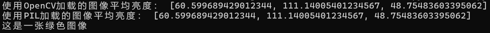
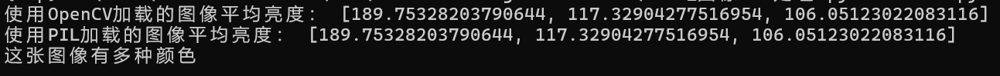

姓名：巩羽飞丨学号：2021522077丨班级：2021669101丨课程：智能信息网络实验

### 题目：Lab2 图像RGB处理

源代码见文末

### 一、问题描述

#### 1.1 待解决问题的解释

本实验旨在解决如何根据图像的平均亮度来判断图像的颜色的问题。通过计算图像各个通道的平均亮度，我们可以推测图像可能是红色、蓝色、绿色或多种颜色之一。

#### 1.2 问题的形式化描述

给定一张图像 $I$，其中 $C_i$ 表示图像 $I$ 的第 $i$ 个通道（红、绿、蓝），$n$ 表示通道数，$p_i$ 表示通道 $C_i$ 的平均亮度。

### 二、系统

#### 2.1 系统架构

系统由以下组件构成：

1. 图像加载模块：负责从本地文件系统加载图像并将其转换为张量表示。
2. 平均亮度计算模块：计算图像各个通道的平均亮度。
3. 颜色判断模块：根据平均亮度判断图像的颜色类别。

#### 2.2 各部分介绍

- **图像加载模块：** 使用OpenCV和PIL库分别加载图像，并将其转换为张量表示。
- **平均亮度计算模块：** 计算图像各个通道的平均亮度。
- **颜色判断模块：** 根据平均亮度判断图像的颜色类别。

#### 2.3 算法的伪代码

```
使用OpenCV加载图像，并计算各个通道的平均亮度。
使用PIL加载图像，并计算各个通道的平均亮度。
根据平均亮度值判断图像的颜色类别：
    如果所有通道的平均亮度值都大于阈值，则判断为红色图像；
    如果所有通道的平均亮度值都小于阈值，则判断为蓝色图像；
    如果第一个通道的平均亮度值小于阈值，第二个通道的平均亮度值大于阈值，第三个通道的平均亮度值小于阈值，则判断为绿色图像；
    否则，判断为多种颜色图像。
```

### 三、实验

#### 3.1 实验环境

- Python 3.6+
- OpenCV 4.5+
- NumPy 1.19+
- PIL 8.0+

#### 3.2 数据

本实验使用的示例图像位于本地路径：`./images/`

#### 3.3 实验结果

实验结果显示，通过平均亮度计算，可以大致判断图像的颜色类别。但由于图像颜色受到光照、色彩饱和度等因素的影响，判断结果可能不够精确。










可以看到，只要阈值调的适当，结果还是很不错的。

### 四、总结与展望

本实验提出了一种基于图像平均亮度的方法来判断图像的颜色类别。虽然在实验中取得了一定的效果，但仍存在一定的局限性。未来可以考虑通过深度学习等方法来提高颜色判断的准确性和鲁棒性。

### 五、参考文献

- OpenCV Documentation: https://docs.opencv.org/
- PIL Documentation: https://pillow.readthedocs.io/en/stable/
- NumPy Documentation: https://numpy.org/doc/stable/

### 六、附录

```Python
"""
Lab2 图像RGB处理源代码：
"""
import cv2
import numpy as np
from PIL import Image

# 定义函数来计算图像的平均亮度
def calculate_brightness(image_tensor):
    # 获取图像的通道数
    channels = image_tensor.shape[2]
    
    # 初始化存储每个通道平均亮度的列表
    avg_brightness = []
    
    # 计算每个通道的平均亮度
    for i in range(channels):
        channel_mean = np.mean(image_tensor[:, :, i])
        avg_brightness.append(channel_mean)
    
    return avg_brightness

# 加载图像并转换为张量（使用OpenCV）
def load_image_with_cv2(image_path):
    # 使用OpenCV读取图像
    image = cv2.imread(image_path)
    # 将图像从BGR格式转换为RGB格式
    image_rgb = cv2.cvtColor(image, cv2.COLOR_BGR2RGB)
    # 将图像转换为张量
    image_tensor = np.array(image_rgb)
    return image_tensor

# 加载图像并转换为张量（使用PIL）
def load_image_with_pil(image_path):
    # 使用PIL库打开图像
    image = Image.open(image_path)
    # 将图像转换为张量
    image_tensor = np.array(image)
    return image_tensor

# 图像路径
image_path = "./images/colorful.jpg"

# 使用OpenCV加载图像并计算平均亮度
image_cv2 = load_image_with_cv2(image_path)
brightness_cv2 = calculate_brightness(image_cv2)
print("使用OpenCV加载的图像平均亮度：", brightness_cv2)

# 使用PIL加载图像并计算平均亮度
image_pil = load_image_with_pil(image_path)
brightness_pil = calculate_brightness(image_pil)
print("使用PIL加载的图像平均亮度：", brightness_pil)

# 根据平均亮度判断图像颜色
threshold = 111  # 设置阈值

if all(brightness_cv2[i] > threshold for i in range(3)):
    print("这是一张红色图像")
elif all(brightness_cv2[i] < threshold for i in range(3)):
    print("这是一张蓝色图像")
elif brightness_cv2[0] < threshold and brightness_cv2[1] > threshold and brightness_cv2[2] < threshold:
    print("这是一张绿色图像")
else:
    print("这张图像有多种颜色")
```

