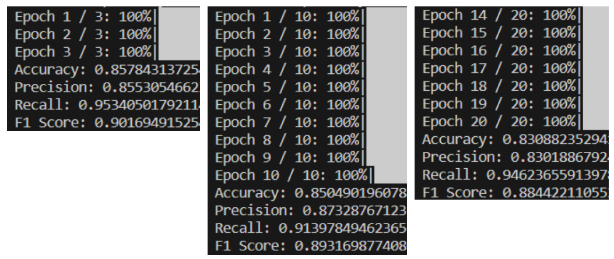

姓名：巩羽飞丨学号：2021522077丨班级：2021669101丨课程：智能信息网络实验

### 题目：Lab4 文本相似度

源代码见文末

### 一、问题描述

#### 1.1 待解决问题的解释

文本相似度旨在识别两段文本在语义上是否相似。文本相似度在自然语言处理领域是一个重要研究方向，同时在信息检索、新闻推荐、智能客服等领域都发挥重要作用，具有很高的商业价值。

#### 1.2 问题的形式化描述

本实验旨在利用文本相似度模型识别两段文本在语义上的相似程度。具体来说，本实验采用了一个二元分类任务，对两段文本进行分类，分为相似和不相似两类。使用了预训练的 BERT 模型作为基础模型，并根据 MRPC 数据集进行训练和评估。

### 二、系统

#### 2.1 系统架构

系统架构包括数据处理、模型构建、训练和评估四个主要步骤：

1. **数据处理**：读取 MRPC 数据集，对数据进行预处理，包括分词、转换为 BERT 模型可接受的输入格式等。
2. **模型构建**：加载预训练的 BERT 模型和 tokenizer，并修改输出层以适应二元分类任务。
3. **训练**：利用训练集对模型进行训练，采用 AdamW 优化器，迭代多个 Epoch。
4. **评估**：利用验证集对模型进行评估，计算准确率、精确率、召回率和 F1 分数等评价指标。

#### 2.2 各部分介绍

- `read_mrpc_dataset(file_path)`: 读取 MRPC 数据集。
- `load_bert_model(model_name, num_labels)`: 加载预训练的 BERT 模型和 tokenizer。
- `preprocess_data(df, tokenizer, max_length)`: 数据预处理，将文本转换为 BERT 模型的输入格式。

#### 2.3 算法的伪代码

```Python
read_mrpc_dataset(file_path):
    从文件中读取MRPC数据集
    返回数据框

load_bert_model(model_name, num_labels):
    使用model_name加载预训练的BERT模型和tokenizer
    构建BERT模型，修改输出层以适应二元分类任务
    返回tokenizer和model

preprocess_data(df, tokenizer, max_length):
    对数据框中的文本进行分词和转换为BERT模型的输入格式
    返回输入的input_ids和attention_masks

main():
    设置参数
    读取训练集和验证集数据
    加载BERT模型和tokenizer，并修改输出层
    数据预处理
    构建数据加载器
    定义优化器
    模型训练
    模型评估
    计算评价指标并打印
```

### 三、实验

#### 3.1 实验环境

- Python 3.10
- PyTorch
- Transformers
- pandas
- tqdm

#### 3.2 数据

实验使用的数据集是 MRPC（Microsoft Research Paraphrase Corpus），包含一系列句子对，每个句子对都有一个标签，表示两个句子之间是否语义相似。

#### 3.3 实验结果

通过训练和评估，我们得到了模型在验证集上的性能指标（Epoch = 3, 10, 20）：



可以看到，结果还是很不错的。另外，可以发现随着 Epoch 的增加，模型开始表现为过拟合，我猜想这可能的原因是数据集较小的问题。

### 四、总结与展望

本实验利用 BERT 模型进行文本相似度任务，取得了较好的性能。未来可以尝试更复杂的模型架构、调整超参数以及利用更大规模的数据集来进一步提升模型性能。

### 五、参考文献

- Devlin, J., Chang, M. W., Lee, K., & Toutanova, K. (2018). BERT: Pre-training of Deep Bidirectional Transformers for Language Understanding. arXiv preprint arXiv:1810.04805.
- Wolf, T., Debut, L., Sanh, V., Chaumond, J., Delangue, C., Moi, A., ... & Brew, J. (2019). HuggingFace's transformers: State-of-the-art natural language processing. arXiv preprint arXiv:1910.03771.

### 六、附录

```Python
"""
Lab4 文本相似度源代码：
"""
import pandas as pd
from sklearn.metrics import accuracy_score, precision_score, recall_score, f1_score
from transformers import BertTokenizer, BertForSequenceClassification, AdamW
import torch
from torch.utils.data import DataLoader, TensorDataset
from torch.nn import functional as F
from tqdm import tqdm

# Load data
def read_mrpc_dataset(file_path):
    df = pd.read_csv(file_path, sep='\t', quoting=3)
    return df

# Compute evaluation metrics
def load_bert_model(model_name, num_labels):
    tokenizer = BertTokenizer.from_pretrained(model_name)
    model = BertForSequenceClassification.from_pretrained(model_name, num_labels=num_labels)
    return tokenizer, model

# Preprocess data
def preprocess_data(df, tokenizer, max_length):
    input_ids = []
    attention_masks = []

    for sent1, sent2 in zip(df['#1 String'], df['#2 String']):
        encoded_dict = tokenizer.encode_plus(
                            sent1,
                            sent2,
                            add_special_tokens = True,
                            max_length = max_length,
                            padding = 'max_length',
                            truncation=True,
                            return_attention_mask = True,
                            return_tensors = 'pt',
                    )

        input_ids.append(encoded_dict['input_ids'])
        attention_masks.append(encoded_dict['attention_mask'])

    input_ids = torch.cat(input_ids, dim=0)
    attention_masks = torch.cat(attention_masks, dim=0)

    return input_ids, attention_masks


def main():
    # Parameters setting
    model_name = 'bert-base-uncased'
    max_length = 128
    batch_size = 32
    num_epochs = 3
    learning_rate = 5e-5
    num_labels = 2  # Binary classification
    device = torch.device('cuda' if torch.cuda.is_available() else 'cpu')

    # Load data
    df_train = read_mrpc_dataset('mrpc_data/train.tsv')
    df_dev = read_mrpc_dataset('mrpc_data/dev.tsv')

    # Load BERT model and tokenizer
    tokenizer, model = load_bert_model(model_name, num_labels)
    model.to(device)

    # Preprocess data
    input_ids_train, attention_masks_train = preprocess_data(df_train, tokenizer, max_length)
    input_ids_dev, attention_masks_dev = preprocess_data(df_dev, tokenizer, max_length)
    labels_train = torch.tensor(df_train['Quality'])
    labels_dev = torch.tensor(df_dev['Quality'])

    # Define DataLoader
    train_data = TensorDataset(input_ids_train, attention_masks_train, labels_train)
    train_loader = DataLoader(train_data, batch_size=batch_size, shuffle=True)

    # Define optimizer
    optimizer = AdamW(model.parameters(), lr=learning_rate)

    # Train the model
    model.train()
    for epoch in range(num_epochs):
        for batch in tqdm(train_loader, desc=f'Epoch {epoch + 1} / {num_epochs}'):
            input_ids, attention_masks, labels = batch
            input_ids, attention_masks, labels = input_ids.to(device), attention_masks.to(device), labels.to(device)

            optimizer.zero_grad()

            outputs = model(input_ids, attention_mask=attention_masks, labels=labels)
            loss = outputs.loss
            loss.backward()
            optimizer.step()

    # Evaluate the model
    model.eval()
    with torch.no_grad():
        input_ids_dev, attention_masks_dev, labels_dev = input_ids_dev.to(device), attention_masks_dev.to(device), labels_dev.to(device)
        outputs = model(input_ids_dev, attention_mask=attention_masks_dev)
        logits = outputs.logits
        probabilities = F.softmax(logits, dim=1)
        predicted_labels = torch.argmax(probabilities, dim=1).cpu().numpy()

    # Compute evaluation metrics and print the results
    accuracy, precision, recall, f1 = compute_metrics(df_dev['Quality'].values, predicted_labels)
    print(f'Accuracy: {accuracy}')
    print(f'Precision: {precision}')
    print(f'Recall: {recall}')
    print(f'F1 Score: {f1}')

if __name__ == "__main__":
    main()
```

